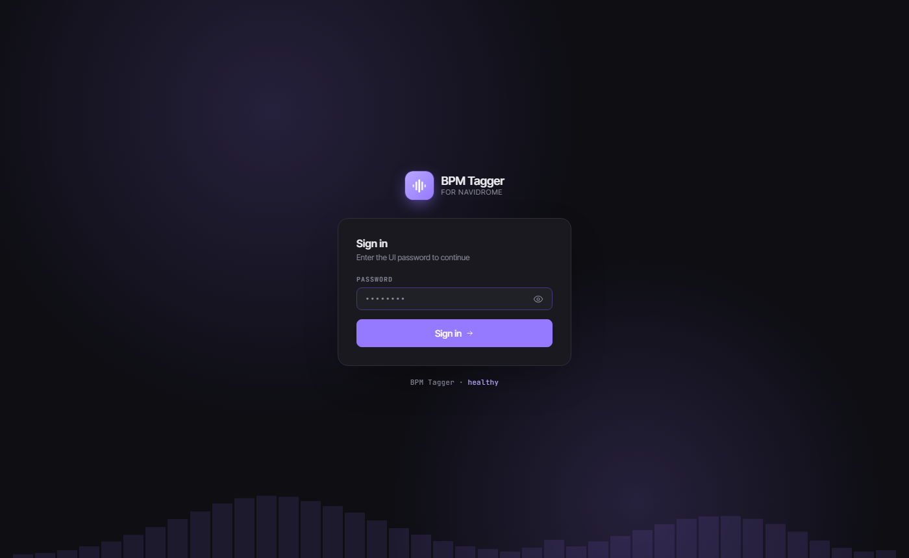
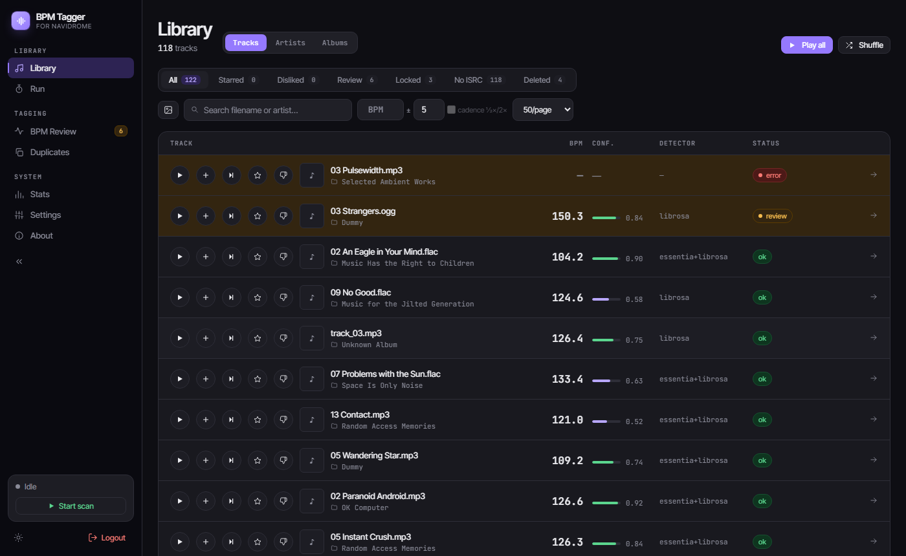
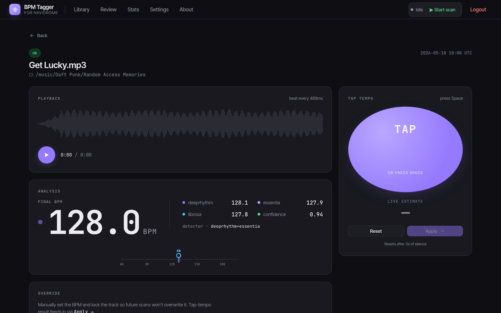
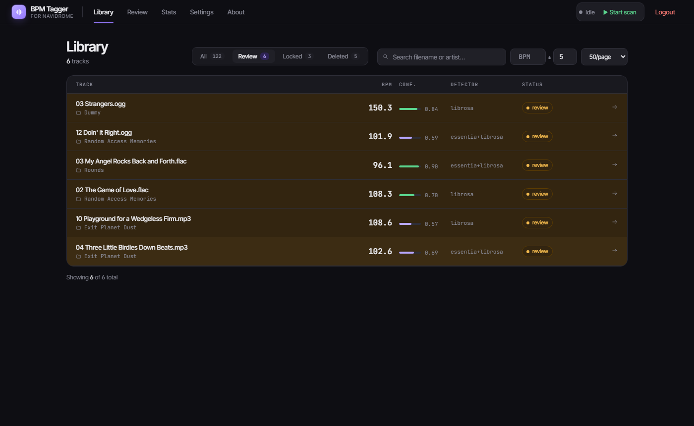
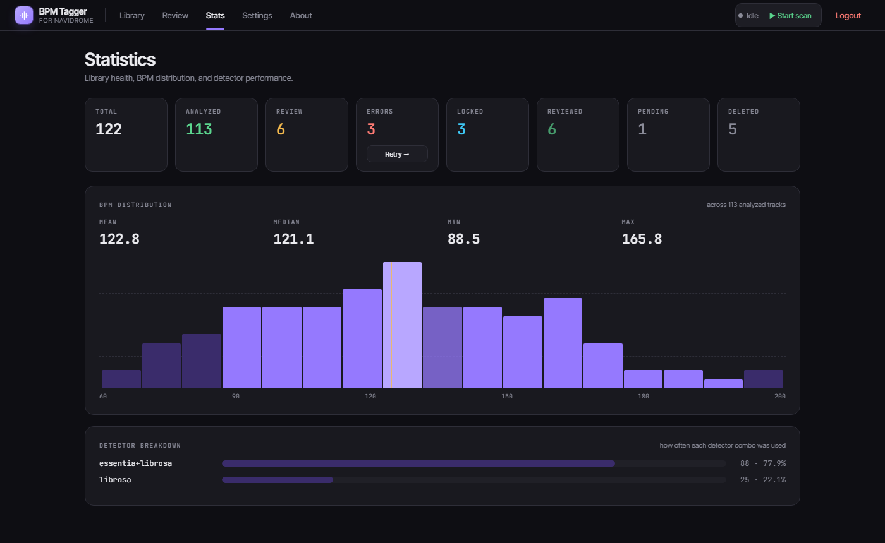
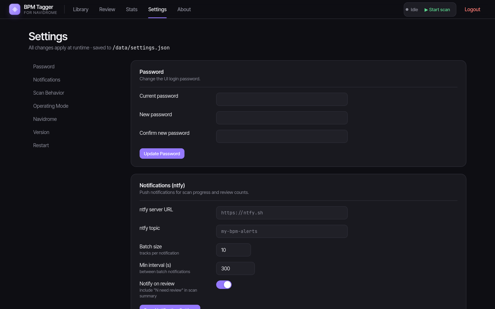
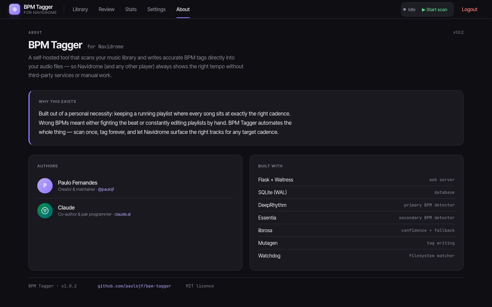
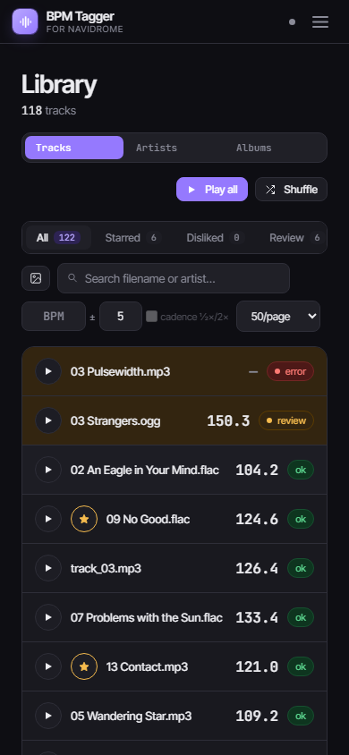
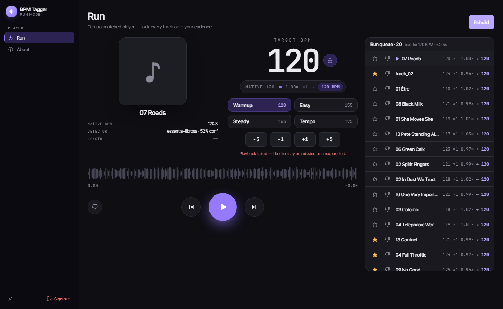
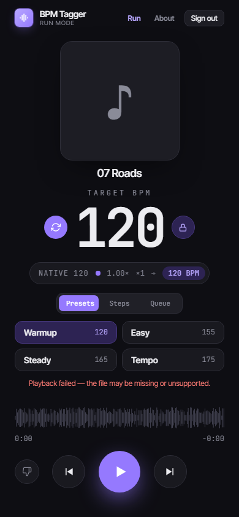

# BPM Tagger

```
██████╗ ██████╗ ███╗   ███╗  ████████╗ █████╗  ██████╗  ██████╗ ███████╗██████╗ 
██╔══██╗██╔══██╗████╗ ████║     ██╔══╝██╔══██╗██╔════╝ ██╔════╝ ██╔════╝██╔══██╗
██████╔╝██████╔╝██╔████╔██║     ██║   ███████║██║  ███╗██║  ███╗█████╗  ██████╔╝
██╔══██╗██╔═══╝ ██║╚██╔╝██║     ██║   ██╔══██║██║   ██║██║   ██║██╔══╝  ██╔══██╗
██████╔╝██║     ██║ ╚═╝ ██║     ██║   ██║  ██║╚██████╔╝╚██████╔╝███████╗██║  ██║
╚═════╝ ╚═╝     ╚═╝     ╚═╝     ╚═╝   ╚═╝  ╚═╝ ╚═════╝  ╚═════╝╚══════╝╚═╝  ╚═╝
                       ▁ ▂ ▃ ▅ ▇ █ ▇ ▅ ▃ ▂ ▁ ▂ ▃ ▅ ▇ ▅ ▃ ▂ ▁
           automatic bpm detection & tagging for navidrome
```

**v2.11.3** · [Changelog](CHANGELOG.md) · [](https://hub.docker.com/r/gatoserio/bpm-tagger)

Automatically detects the BPM of every song in your [Navidrome](https://www.navidrome.org/) music library and writes the result back to the file's metadata tag, tracking everything in a SQLite database and exposing a password-protected web UI for reviewing and correcting results.

**Now with an optional Spotify grabber:** watch your own Spotify playlists, compare them against what's already on disk, and automatically download the tracks you're missing — via **Deezer** (your own ARL) with a **yt-dlp** fallback — transcoding to one configured format, writing full tags + cover art, running the same three-detector BPM analysis, and filing them into your library by a customizable path template. Ambiguous matches wait in an inbox and ping you over [ntfy](https://ntfy.sh/).

## Screenshots

| Login | Library |
|---|---|
|  |  |

| Track detail | Review queue |
|---|---|
|  |  |

| Statistics | Settings |
|---|---|
|  |  |

| About | Library (mobile) |
|---|---|
|  |  |

Same sign-in screen gates the full admin UI and the locked-down **player mode** (the shared **Guest login**, `RUN_PASSWORD`, or a **named player user** with a username — Settings → Player access) — the difference shows up after login, in what the session can reach:

| Player mode | Player mode (mobile) |
|---|---|
|  |  |

## Features

- **Three-detector BPM analysis** — [deeprhythm](https://github.com/bleugreen/deeprhythm) (CNN) and [essentia](https://essentia.upf.edu/) `RhythmExtractor2013` run as dual primary detectors; [librosa](https://librosa.org/) multi-segment analysis always runs as confidence scorer and tiebreaker
- **Octave error correction** — when any two detectors return a 2× discrepancy, the value inside your configured BPM range wins automatically
- **Plausibility normalization** — BPM is halved/doubled until it falls inside `[BPM_MIN, BPM_MAX]`
- **Parallel processing** — configurable worker thread pool; each thread maintains its own model instance for safe concurrent analysis
- **Tag writing** — writes the `BPM` tag to MP3 (ID3 `TBPM`), FLAC, OGG/Opus (Vorbis comment), M4A/AAC (MP4 `tmpo`), and any other format via mutagen
- **SQLite tracking** — records every file's path, hash, both raw detector values, final BPM, confidence, and timestamp; re-analyzes only files that are new or changed
- **Review flagging** — tracks where detectors genuinely disagree, confidence is low, or only the fallback was used are flagged `needs_review` in the DB; approving or locking a flagged track marks it `reviewed` (green badge) so it stays out of the queue
- **Web UI** — browser interface to browse all tracks, review flagged ones, play audio, and correct BPM with a tap-tempo button; live search and BPM ± tolerance filter; Prev/Next navigation moves through the review queue without returning to the list; back navigation preserves filter, page, and search state
- **Related panel** — every Artist, Album and Track page carries a collapsible **Related · powered by Deezer** panel: similar artists (with in-library ones linking straight to their library page, and track counts showing what you own) and similar tracks, looked up live from the keyless Deezer catalog only when you expand it. Read-only and useful even with the grabber off; with it on, missing tracks get an **Add to queue** button. The artist page also gets a **Browse Deezer** button that opens the artist's full catalog — top tracks and complete discography (albums + singles/EPs) with 30-second previews, single tracks or whole releases addable to the download queue when the grabber is on
- **Queue similar from the player** — a similar-tracks button on the player bar (and **≈ Similar** on the Run page's queue view) lists tracks in the style of the now-playing artist: in-library matches queue straight onto the **play queue** (cadence-checked during a tempo-locked run — tracks that can't stretch onto the target show **off cadence** instead), missing ones get a **Grab** button for the download queue, and **Queue all** grabs every eligible match at once
- **30-second previews** — suggested and related tracks show a ▶ **preview** button that streams Deezer's 30 s clip through the normal player: starting one while music is playing ducks the queue and auto-resumes when the clip ends, so you can audition before grabbing
- **Floating mini player** — pop the now-playing card out into an always-on-top window that stays put as you switch tabs or apps: the track's **cover art fills the background** (blurred, behind a glass now-playing card), title/artist, a seekable progress bar, prev/play/next, volume, and (in Run mode) the tempo-lock pill with the pulsing beat dot. Uses the Document Picture-in-Picture API (Chromium desktop); **clicking the Run page's cover pops it out** (the button also sits in the player bar), it's hidden where the API isn't available, and opening it as an installed PWA tucks the main window away where the runtime allows. Playback stays in the main tab — the window just drives it — and it follows the app's light/dark theme
- **Lyrics** — fetch plain or synced (LRC) lyrics from [LRCLIB](https://lrclib.net) (free, community-run, no account) per track or in bulk, view/edit them on the track page, and store them embedded in the tag or as a `.lrc` sidecar; Navidrome and most players pick them up
- **Run mode** — a full-screen tempo-run player that fits one phone screen: viewport-scaled cover art, a big target-BPM readout with the tempo-lock toggle and a `native · stretch × octave → result` breakdown, ±1/±5 steps, four **named presets** or an in-place **queue view**, a lyrics drawer, waveform scrubbing and large transport buttons; auto-queues the tracks whose octave-folded BPM matches the target — starred tracks first — **refills the queue automatically when the last track starts**, and **locks the tempo** so every song stretches onto your step, pitch preserved
- **Run from a playlist** — build the run queue from your **whole library** or a specific **playlist** via a source picker; the pool starts from that playlist's matched, BPM-tagged tracks, and a per-playlist "N of M available" count shows how much of it is actually runnable. A run **prefers the playlist's matches and tops up from your library at the same cadence** when the playlist has too few tracks matching your target — so a small playlist never loops one song (a note flags when a run was topped up, and the library-added tracks are **dimmed** (and italicised) in the run queue so you can tell them from the playlist's own)
- **Playlist run-readiness** — a playlist's detail page shows each matched track's **BPM and length** and links straight to its **track / artist / album** pages, so you can see which tracks are runnable and at what cadence
- **Cadence views** (`/cadence`) — "what can I run at 165?", answered by the *exact* rule the run queue uses (octave fold + your max-stretch limit), listing every eligible library track closest-cadence-first with its `native → folded ×rate` math. **▶ Play** / **⇄ Shuffle** / **+ Add to queue** them, **save the lot to a playlist**, or **Open in Run** to run *to* that cadence with the tempo lock. The **Playlists** page carries a strip of your run presets with a live library-ready count linking into each, and every playlist card shows quiet per-preset counts (`155:11 · 165:8`) — clicking one starts a run at that cadence with that playlist as the source
- **Play a playlist** — any playlist's detail page has **▶ Play**, **⇄ Shuffle** and **+ Add to queue**, playing the tracks you actually own (volume-levelled like the rest of the library). They follow the tab you're on, so the **Have** tab plays exactly what you see, and the button carries the playable count when it's smaller than the list (`▶ Play (12)` for a 50-track playlist with 12 matched). Starting any queue this way **ends a run in progress** — the tempo lock releases and the run's auto-refill stops, so a playlist can't be quietly stretched onto your cadence or padded with run-mode tracks (use the Run page's source picker to run *to* a playlist)
- **Run stats** — Run mode keeps cumulative usage totals on the Stats page: tracks played, total time on feet (with the native audio duration covered), how much was tempo-shifted vs played at native speed, average cadence, and time spent per cadence band
- **Starred & disliked tracks** — star favourites or dislike tracks you never want in a run, from the library, track page, or mid-run; **Starred**/**Disliked** filter pills in the library, and run queues prefer starred tracks while permanently skipping disliked ones
- **Volume levelling** — every track's perceived loudness (LUFS, EBU R128) is measured during the BPM scan, and the player brings loud masters down to a target so one hot track doesn't blast you mid-run. Existing ReplayGain tags are reused instead of re-measured, and tracks with no measurement play untouched
- **"No playlist" library filter** — a filter pill (with a live count) that shows every track not in *any* playlist — Spotify, Navidrome, or Local — so you can find orphaned tracks and file them; removed (tombstoned) playlist rows don't count as coverage
- **Image editing** — change any track's cover, set an album cover across **all** of its tracks at once, or pick a custom artist image — searching Spotify (when connected) and Deezer for candidates, pasting a URL, or uploading a file
- **Re-analyze on demand** — re-run BPM detection for a single track from its detail page without starting a full library scan. The same page shows the track's measured **loudness** (and whether it came from a ReplayGain tag or a real measurement) with a **Measure loudness** button to re-measure it from the audio
- **Login brute-force protection** — layered rate limiting locks out repeated failed logins **per IP, per account, and globally**, so a distributed attack (many IPs) can't slip under the per-IP cap
- **Admin two-factor (TOTP)** — optionally require a 6-digit authenticator-app code on top of the admin password (Settings → Two-factor), with one-time recovery codes and a `MODE=disable_2fa` escape hatch
- **Navidrome auto-rescan** — optionally triggers a Navidrome library rescan via the Subsonic API after every scan, and also when the watch-mode queue drains after tagging new files, so new BPM tags appear immediately
- **Navidrome star sync** — two-way: stars set in BPM Tagger push to Navidrome as favourites, stars set in Navidrome pull in (and feed the Run queue's starred preference). A per-track baseline keeps "starred here" and "un-starred there" apart; **Sync stars now** lives in Settings → Navidrome
- **Navidrome scrobbling & play counts** — opt-in: tracks played in the built-in player (Run mode included) scrobble to Navidrome once they pass the halfway mark, so play counts and "last played" stay accurate everywhere (and reach Last.fm/ListenBrainz if Navidrome forwards there); **Pull play counts** imports Navidrome's play counts per track, shown on the track page and usable as a run-queue preference (**prefer familiar tracks**)
- **Health check endpoint** — `/healthz` returns DB statistics as JSON; no login required, suitable for Docker/k8s probes
- **ntfy notifications** — batched and rate-limited; scan summaries include a "N need review" count
- **Manual lock** — pin a track's BPM so future scans never overwrite it
- **Slim and full Docker images** — the default `:latest` image (~400 MB, no PyTorch) uses essentia + librosa; the `:full` image (~1.8 GB) adds deeprhythm CNN for maximum accuracy
- **Fully Docker-native** — all settings via environment variables in `docker-compose.yml`

### Music grabber (optional, `GRABBER_ENABLED=true`)

- **Multi-source playlists** — the Playlists page watches playlists from **Spotify** (connect your account by one-time OAuth, add by URL or pick from a browser of your own playlists), **Navidrome** (pick from your own Navidrome playlists over Subsonic), and your own **Local** playlists (see below). Navidrome and Local playlists need no grabber and no Spotify. Each is reconciled against your library on a schedule (watch mode) or on demand, and any playlist can be used as a **Run-mode source**
- **Local playlists + "Add to playlist"** — build a playlist by hand: create one by name, then add any library track from an **"Add to playlist"** button on its track page, a Library row, or a row of any playlist's detail page (pick an existing local playlist or create one inline). Added tracks are on-disk by definition, so they count as **have** immediately — no sync, no missing tracks; remove a track or delete the playlist whenever you like. Local playlists need no grabber at all. A local playlist's detail page also carries a **Suggestions** panel (admin only) — Deezer artist-radio picks seeded from the playlist's own most-frequent artists (with a picker to switch artists): in-library matches add straight to the playlist, missing ones use the download queue when the grabber is on, and tracks already in the playlist are filtered out
- **Copy a whole playlist into a local one** — any playlist's detail page (Spotify, Navidrome, or another Local) has an **"Add all to playlist…"** action that copies every library-backed (**have**) track into a local playlist you pick or create inline. Duplicates are skipped and tracks you don't own yet can't be copied, so the result is reported as *added / already there / not in library* (fetch the missing ones separately with **Download missing** when the grabber is on)
- **Save a run as a playlist** — the Run page's queue panel has a **Save…** action that writes the queue you just ran — in its exact order — into a local playlist you pick or create inline, reporting *added / already there / not in library*. A good run is otherwise gone the moment you build the next one
- **Reorder a local playlist** — drag rows by their grip, or use the per-row **↑ / ↓** buttons on touch; the new order saves atomically and is what **▶ Play** follows. Local-only (a synced playlist takes its order from its source), and available only on the unsorted, unfiltered **All** view — reordering a projection of the playlist has no single meaning
- **Sort, search and de-duplicate inside a playlist** — a search box and a sort control (playlist order, title, artist, BPM, length — unanalyzed tracks last) narrow and reorder the view; **▶ Play** / **⇄ Shuffle** / **+ Add to queue** follow exactly what's on screen, the same contract the status tabs already have. Rows that point at the **same library file** (or share an **ISRC**) are flagged as duplicates with a count and a **duplicates-only** view — on a Local playlist the row's ✕ removes the extra, and on a synced one it's informational, since the source owns membership
- **Cover art everywhere** — playlist rows show each track's artwork: the **embedded cover of your own file** for tracks you have, the source's own image for ones you don't, and a ♪ placeholder otherwise (so the column stays aligned). It follows the global **artwork toggle** in the page header — switch it off and the layout is exactly as before. **Local playlists get a cover too**: pick one from the built-in Spotify/Deezer image search, paste a URL, or upload a file — and with none set, the page builds an automatic **2×2 collage** from the playlist's own tracks (one tile per album; a single cover when there are fewer than four). Custom covers are Local-only, since a synced playlist's art belongs to its source
- **Rename, describe and pin** — give any playlist a **description** (shown on its card and detail page) and **pin** it so it sorts to the top of the Playlists page and the Run source picker; both stick to Spotify and Navidrome playlists too, because a sync never touches them. **Renaming** is Local-only — a synced playlist takes its name from its source, and would silently revert on the next sync
- **Have / missing / queued + change tracking** — every synced playlist track is matched to your library by ISRC or a fuzzy title+artist+duration score (Navidrome by metadata); the ones you're missing are enqueued automatically (Spotify), and each sync flags **new** tracks and tombstones **removed** ones so the detail view shows what changed since you last looked (Local playlists don't sync — their membership is just what you added)
- **Downloading** — tries **Deezer** (via [streamrip](https://github.com/nathom/streamrip), using your own Deezer ARL) first, then falls back to **yt-dlp** (YouTube Music); provider order is configurable. Deezer also supplies ISRCs, which sharpen library matching. _(A free Deezer ARL returns full-length tracks at MP3 128 kbps; MP3 320/FLAC need a paid Deezer subscription. The Monochrome/Tidal provider is currently on hold.)_
- **One output format** — every download is transcoded via ffmpeg to a single configured profile (`mp3-128`, `mp3-320`, `flac`, or `opus-192`)
- **Full tagging + BPM** — writes title/artist/album/track/year/ISRC + embedded cover art, then runs the same 3-detector BPM analysis and tags the result; files land under a customizable **path template** (default `{AlbumArtist}/{Album}/{TrackNo:02d} - {Title}.{ext}`)
- **Suggestions** (`/suggestions`) — a page of **artists you don't have yet** and **tracks worth grabbing**, derived from what's already in your library (starred and most-played artists weigh heaviest). One-click **Add to queue** feeds the same download pipeline; artists/tracks you already own are filtered out (artists you've _sampled_ — 1–2 tracks — still surface, badged), and anything you dismiss stays gone across refreshes. Powered by the **Deezer public catalog** (keyless — no account, works even without Spotify connected)
- **Artist detail popup** — clicking a suggested (or related) artist — or the **Browse Deezer** button on a library artist page — opens a popup with a short description, top tracks, and the full discography split into albums and singles/EPs; expand any release for its tracklist, add single tracks, or **Add all** to queue a whole album/single at once (owned/queued tracks skipped). The description is a best-effort lookup via MusicBrainz → Wikidata → Wikipedia (all keyless)
- **Ambiguity inbox** — low-confidence matches wait for you to choose a candidate, **search again** (re-run the default search) or refine the query, or skip; you get an ntfy ping with a tap-through link. Cards collapse to a one-line summary (title, source preview, candidate count, best-match score) so a full inbox scans quickly — click a card to expand it, or **Expand all / Collapse all** from the header; each card's artist links to its artist page
- **Queue** — live download progress, retry/cancel, delete failed items, clear completed, and history; every item's **artist links to its artist page** (where **Browse Deezer** works even for artists you don't own yet), while title/album link in once the download is filed into the library
- **Metadata editor** — edit tags + cover on any track and optionally rename it to the path template (the watcher won't re-analyze the edited file)
- **m3u export & duplicate resolution** — export a playlist's on-disk tracks; a dedicated **Duplicates** page lists library duplicates (same normalized artist+title or shared ISRC) to step through side-by-side and move unwanted copies to a recoverable **trash** (purged from Settings)
- **ISRC lookup & fill** — a **Find ISRC** button on the track-detail and compare views looks up a track's ISRC from Deezer / Spotify / MusicBrainz; a **bulk fill** (Settings → ISRC) fills every track missing one — auto-writing confident, duration-matched results and listing the rest for you to choose. ISRCs sharpen duplicate detection and library matching.
- **Managed, never clobbered** — grabbed tracks are marked `managed`; the BPM hash is stamped after tagging so the library watcher leaves them alone

---

## Quick Start

1. Clone this repository and edit `docker-compose.yml`:
   - Set `volumes` → point `/music` at your Navidrome music directory
   - Set `NTFY_TOPIC` to your ntfy topic (or leave blank to disable)
   - Set `UI_PASSWORD` if you want to enable the web UI
   - Uncomment `user:` and set it to match your Navidrome user/group if you see permission errors

2. Build and run:
   ```bash
   docker compose up -d --build
   ```

3. Follow the logs:
   ```bash
   docker compose logs -f
   ```

4. Open the web UI (if enabled):
   ```
   http://your-host:5000
   ```

> **⚠️ LAN / local access only by default.** The web UI has no TLS. If you want to reach it from outside your home network, put a reverse proxy (nginx, Caddy) with HTTPS in front of port 5000 — do not expose it to the internet over plain HTTP.

---

## Hardware / Memory

Two image variants are published to Docker Hub:

| Image tag | Detectors | Peak RAM | Build |
|---|---|---|---|
| `latest` _(default)_ | essentia + librosa | ~400 MB | slim, no PyTorch |
| `full` | deeprhythm (CNN) + essentia + librosa | ~1.8 GB | with PyTorch CPU |

For the `full` image, peak RAM scales with workers:

| `WORKERS` | Peak RAM |
|---|---|
| 1 | ~870 MB |
| 2 | ~1 350 MB |
| 4 | ~2 300 MB |

Set `deploy.resources.limits.memory` in `docker-compose.yml` to at least the peak RAM for your configuration. The defaults (`latest` image, limit `800M`) are sized for NAS devices. Switch to `:full` and raise the limit if you want CNN accuracy.

---

## Operating Modes

Set the `MODE` environment variable to one of the following:

| Mode | Description |
|---|---|
| `watch` | Scans all unscanned/changed files on startup, then watches the music directory for new or modified files using filesystem events. A 10-second debounce prevents processing files still being copied. **Recommended default.** |
| `watch_all` | Re-analyzes every file on startup (overwriting existing results), then enters watch mode for new/changed files. Use when you want a full re-analysis pass followed by continuous watching. |
| `scan_all` | One-shot: re-analyze every audio file, overwriting all existing results regardless of whether the file has changed |
| `scan_unscanned` | One-shot: only analyze files not yet in the database, files whose content has changed (detected via size+mtime hash), and files with `status='error'`. Locked tracks are always skipped. |
| `scan_review` | One-shot: re-analyze only tracks that are flagged for review (`needs_review=1`), have `status='error'`, or were only analyzed by the librosa fallback. Useful for a quick follow-up pass after you've tuned detection settings. |
| `report` | Queries the database for suspicious tracks (detector disagreement, low confidence, fallback-only, out-of-range BPM), logs them, writes a CSV to `REPORT_PATH`, and sends an ntfy summary if configured. Does not analyze any files. |
| `lock` | Locks a single track so it is never re-analyzed. Requires `LOCK_FILE` (absolute path inside the container). Optionally provide `LOCK_BPM` to set a corrected BPM value and write it to the file tag at the same time. |
| `unlock` | Removes the lock from a track so it will be re-analyzed on the next scan. Requires `UNLOCK_FILE` (absolute path inside the container). |

### Lock / Unlock Examples

```bash
# Lock a track and correct its BPM to 128
docker compose run --rm --no-deps bpm-tagger \
  env MODE=lock LOCK_FILE="/music/Artist/Album/track.mp3" LOCK_BPM=128 \
  python -m bpm_tagger

# Lock a track at its current BPM (just prevent future re-analysis)
docker compose run --rm --no-deps bpm-tagger \
  env MODE=lock LOCK_FILE="/music/Artist/Album/track.mp3" \
  python -m bpm_tagger

# Unlock a track
docker compose run --rm --no-deps bpm-tagger \
  env MODE=unlock UNLOCK_FILE="/music/Artist/Album/track.mp3" \
  python -m bpm_tagger
```

---

## Configuration Reference

All settings are environment variables. Every variable has a default and is documented with a comment in `docker-compose.yml`.

### Core

| Variable | Default | Description |
|---|---|---|
| `MODE` | `watch` | Operating mode (see above) |
| `MUSIC_DIR` | `/music` | Path to the music directory inside the container |
| `DB_PATH` | `/data/bpm_tagger.db` | SQLite database path inside the container |
| `WRITE_TAGS` | `true` | Write the detected BPM back to each audio file's metadata tag |
| `PRESERVE_MTIME` | `true` | Restore each file's modified time after tagging, so Navidrome, backups and sort-by-date aren't disturbed. Setting this in docker-compose locks the toggle in the web UI |
| `AUDIO_EXTENSIONS` | `.mp3,.flac,.ogg,.m4a,.aac,.wav,.opus,.wv` | Comma-separated list of file extensions to process |
| `WORKERS` | `1` | Number of parallel worker threads for BPM analysis. Each worker loads its own deeprhythm model instance (~500 MB RAM each). Keep at `1` on NAS/low-memory devices; raise to `2`–`4` on a server with ample RAM. |
| `REFRESH_HASHES` | `false` | Before the scan starts, recompute the stored `size:mtime` hash for every already-analyzed track. Set to `true` after upgrading from a version that saved the pre-tag hash (causing every tagged file to be re-analyzed on every restart). Safe to leave enabled permanently — it adds a few seconds on large libraries but never triggers re-analysis by itself. |
| `LOG_LEVEL` | `INFO` | Log verbosity: `DEBUG`, `INFO`, `WARNING`, `ERROR` |

### BPM Detection Quality

| Variable | Default | Description |
|---|---|---|
| `BPM_MIN` | `60` | Plausibility floor — BPM values below this are doubled until in range. Narrow to `90` for pop/rock; widen to `40` for very slow music. |
| `BPM_MAX` | `200` | Plausibility ceiling — BPM values above this are halved until in range. Raise to `220` for fast electronic music. |
| `OCTAVE_CORRECTION` | `true` | When any two detectors return a value that is approximately double/half the other, pick the one inside `[BPM_MIN, BPM_MAX]`. Fixes the most common class of detection errors. |
| `USE_DEEPRHYTHM` | `false` | Enable deeprhythm (PyTorch CNN) as a primary detector. **Only has an effect on the `:full` Docker image** — the default `:latest` image does not include PyTorch and silently ignores this setting. Set to `true` on the `:full` image to activate the CNN detector; set to `false` to save ~500 MB RAM per worker even on the full image. |
| `USE_ESSENTIA` | `true` | Enable essentia `RhythmExtractor2013` as the second primary detector. Set to `false` to revert to librosa-only mode. |
| `MULTI_SEGMENT` | `true` | Run librosa on N evenly-spaced windows across the track instead of a single 180s block. Reduces the influence of quiet intros and outros. |
| `MULTI_SEGMENT_COUNT` | `3` | Number of windows for multi-segment librosa analysis |
| `SEGMENT_DURATION` | `45` | Duration in seconds of each analysis window |

### Loudness & Volume Levelling

| Variable | Default | Description |
|---|---|---|
| `MEASURE_LOUDNESS` | `true` | Measure each track's integrated loudness (LUFS, ITU-R BS.1770) during the BPM scan. Files that already carry a ReplayGain tag are read rather than re-measured, so an already-tagged library costs nothing extra. Set to `false` to skip loudness entirely. |
| `NORMALIZE_PLAYBACK` | `true` | Apply the levelling during playback. Tracks louder than the target are attenuated; quieter ones and unmeasured ones play untouched. |
| `LOUDNESS_TARGET_LUFS` | `-14` | Target playback loudness in LUFS (`-14` is the streaming-service norm). Range `-30`…`-5`. Lower attenuates more tracks. |

All three are also editable live in **Settings → Playback**, which additionally has a **Measure missing loudness** back-fill for libraries scanned before this existed.

### Review & Flagging

| Variable | Default | Description |
|---|---|---|
| `REVIEW_CONFIDENCE_THRESHOLD` | `0.4` | Tracks with a librosa confidence score below this value are flagged `needs_review` in the database |
| `REVIEW_DISAGREE_THRESHOLD` | `15` | BPM difference between the two primary detectors (after octave correction) that triggers a `needs_review` flag |
| `REPORT_PATH` | `/data/review_report.csv` | Path where `MODE=report` writes the CSV export of suspicious tracks |

### ntfy Notifications

| Variable | Default | Description |
|---|---|---|
| `NTFY_URL` | `https://ntfy.sh` | ntfy server base URL. Leave `NTFY_URL` or `NTFY_TOPIC` empty to disable all notifications. |
| `NTFY_TOPIC` | _(empty)_ | ntfy topic name. Leave empty to disable. |
| `NTFY_BATCH_SIZE` | `10` | Maximum number of tracks to include in a single tagging notification |
| `NTFY_MIN_INTERVAL` | `300` | Minimum seconds between batched tagging notifications (anti-spam) |
| `NTFY_NOTIFY_REVIEW` | `true` | Include a "N need review" count in the scan-complete summary notification |

### Navidrome Integration

| Variable | Default | Description |
|---|---|---|
| `NAVIDROME_URL` | _(empty)_ | Base URL of your Navidrome instance, e.g. `http://navidrome:4533`. Leave empty to disable. |
| `NAVIDROME_USER` | _(empty)_ | Navidrome admin username |
| `NAVIDROME_PASS` | _(empty)_ | Navidrome admin password |
| `NAVIDROME_STAR_SYNC` | `false` | Initial state of the **two-way star sync** toggle (Settings → Navidrome). |
| `NAVIDROME_SCROBBLE` | `false` | Initial state of the **Scrobble plays** toggle (Settings → Navidrome). |

When URL/user/password are set, BPM Tagger calls Navidrome's Subsonic-compatible `/rest/startScan` endpoint:
- At the end of every `scan_all`, `scan_unscanned`, and `scan_review` one-shot run
- In `watch` / `watch_all` mode: once when the pending-file queue drains after tagging new files (60-second cooldown between rescan calls)

This triggers a Navidrome library rescan automatically so the new BPM tags appear in your music player without a manual rescan step.

**Two-way star sync** (enable in Settings → Navidrome, then **Sync stars now**): each pass fetches Navidrome's starred songs in one `getStarred2` call and reconciles them with the app's starred flags via a per-track three-way merge against the last-synced baseline — a star set on either side since the last sync propagates to the other, and an un-star on one side is never mistaken for a star on the other. Songs are matched by file path (differing roots between the two containers are tolerated) with a title/artist/duration fuzzy fallback; resolved Navidrome song ids are cached for later passes. Pushing a locally-starred track that Navidrome hasn't starred uses a `search3` lookup. A failed remote write leaves that track's baseline untouched, so it simply retries on the next sync; the result toast reports pulled / pushed / unmatched / failed counts. Manual trigger only for now.

**Play counts** are tallied **locally** by the built-in player: every play — player bar and Run mode alike — bumps the track's count once it passes the halfway mark (previews and 30-second clips never count). This works with no Navidrome at all, and the counts persist while Navidrome is disconnected. They show on the track detail page, feed the Stats **Most played** card, and power the Run-mode **prefer familiar tracks** option (most-played matches first, within the starred preference).

**Scrobbling** (enable in Settings → Navidrome): when configured, the same plays are also forwarded to Navidrome (which feeds its own Last.fm/ListenBrainz forwarding), matched by the cached-id / path / fuzzy chain shared with the star sync. Forwarding is best-effort — an unmatched track or a rejected scrobble never undoes the local count.

**Pull play counts** (Settings → Navidrome → **Pull play counts**): imports Navidrome's per-song counts and last-played timestamps. The pull **merges** with the local tally — it takes `MAX(local, remote)`, so it never discards plays counted locally (e.g. while disconnected) yet still picks up higher counts from other Subsonic clients, and a play it already forwarded is never double-counted.

#### Smart playlists on your BPM tags

No BPM Tagger feature at all — just a consequence of the tags it writes. Navidrome's [smart playlists](https://www.navidrome.org/docs/usage/smartplaylists/) can filter on the `bpm` field, so once your library is tagged, a `.nsp` file dropped anywhere in the music folder becomes a live cadence playlist in **every** Subsonic client (phone apps, car head units — no BPM Tagger required):

```json
{
  "name": "Cadence 170–180",
  "any": [
    { "inTheRange": { "bpm": [170, 180] } },
    { "inTheRange": { "bpm": [85, 90] } }
  ],
  "sort": "bpm",
  "order": "asc"
}
```

Save it as e.g. `cadence-170-180.nsp`, let Navidrome rescan, done. The second range mimics Run mode's octave folding — an 85 BPM track steps at 170 with a foot on every beat; drop that block if you only want true-tempo matches. (Unlike Run mode, a smart playlist can't tempo-lock: tracks play at native speed.)

### Music Grabber

Disabled by default. Set `GRABBER_ENABLED=true` (requires `ENABLE_UI=true`) to turn on Spotify playlist sync + downloading.

| Variable | Default | Description |
|---|---|---|
| `GRABBER_ENABLED` | `false` | Master switch for the grabber subsystem. Requires a restart to take effect. |
| `SPOTIFY_CLIENT_ID` | _(empty)_ | Spotify app Client ID (env-only, never stored in `settings.json`). Create an app at [developer.spotify.com/dashboard](https://developer.spotify.com/dashboard). |
| `SPOTIFY_CLIENT_SECRET` | _(empty)_ | Spotify app Client Secret (env-only). |
| `SPOTIFY_REDIRECT_URI` | _(empty)_ | Must match the app's redirect URI **byte-for-byte** and end in `/api/spotify/callback`. Use `https://…` in production or the loopback literal `http://127.0.0.1:5000/api/spotify/callback` for local (not `localhost`). |
| `SPOTIFY_SYNC_MINUTES` | `30` | How often watched Spotify playlists are re-synced when the grabber's own background sync thread runs (watch mode, grabber enabled). |
| `SYNC_INTERVAL_MINUTES` | `0` | Minutes between automatic background sync passes for **playlists (Spotify + Navidrome), two-way star sync, and play-count pulls**. `0` = off (use the manual buttons). Floored to 5 when set. Runs only in watch mode; each job self-gates on its own toggle/credentials, so it works with the grabber disabled. Also settable in **Settings → Navidrome → Background sync**. |
| `UI_PUBLIC_URL` | _(empty)_ | Public base URL used in ntfy click links (e.g. the inbox deep link). |
| `INDEX_TAGS` | `true` | Read file tags into the DB for library matching. Leave on. |
| `PROVIDER_ORDER` | `deezer,ytdlp` | Providers tried in order. `deezer` is skipped unless `DEEZER_ARL` is set; `monochrome` is currently on hold and always skipped. |
| `DEEZER_ARL` | _(empty)_ | Your Deezer ARL token (env/config only, never logged). Enables the Deezer provider. A free-tier ARL returns full tracks at 128 kbps. |
| `DEEZER_QUALITY` | `MP3_128` | Requested Deezer quality: `MP3_128` (free), `MP3_320` or `FLAC` (require a paid Deezer subscription). |
| `MONOCHROME_BASE_URL` | _(empty)_ | Base URL of your self-hosted Monochrome (Tidal proxy). _(Provider on hold — see PROVIDER_ORDER.)_ |
| `MONOCHROME_API_KEY` | _(empty)_ | Monochrome API key (env-only). |
| `MONOCHROME_QUALITY` | `LOSSLESS` | Requested quality (`LOSSLESS` → `HIGH` → `LOW`). |
| `OUTPUT_FORMAT` | `mp3-128` | Single transcode target: `mp3-128`, `mp3-320`, `flac`, or `opus-192`. (128 kbps matches the free Deezer source, so no wasteful upscale.) |
| `PATH_TEMPLATE` | `{AlbumArtist}/{Album}/{TrackNo:02d} - {Title}.{ext}` | Destination path template for downloaded files. |
| `GRAB_WORKERS` | `1` | Concurrent download/transcode workers (max 3). |
| `GRAB_DRY_RUN` | `false` | Match + plan downloads without actually downloading (routes to the inbox). |
| `AUTO_ACCEPT_THRESHOLD` | `0.85` | Match score at/above which a candidate is downloaded automatically (ISRC match = instant accept). |
| `ASK_THRESHOLD` | `0.55` | Below auto-accept but at/above this → the track waits in the inbox for a decision. |

**Connecting Spotify:** with the three `SPOTIFY_*` vars set and the grabber enabled, open **Settings → Grabber → Connect Spotify** in the UI, approve the one-time consent, then add playlists on the **Playlists** page (paste a URL/ID or use **Browse my playlists**). Client Credentials can't read playlist contents post-Feb-2026, so the Authorization Code flow (owner login → stored refresh token → unattended thereafter) is required; keep the owning account Premium.

### Web UI

| Variable | Default | Description |
|---|---|---|
| `ENABLE_UI` | `false` | Set to `true` to start the web interface. Runs as a thread inside the same container alongside the scanner/watcher. |
| `UI_PORT` | `5000` | Port the web UI listens on inside the container |
| `UI_PASSWORD` | _(empty)_ | **Required** — password for the web UI login page. The UI will not start if this is blank. |
| `UI_SECRET_KEY` | _(empty)_ | Flask session secret key. Auto-generates a random key if empty — sessions are invalidated on each container restart. Set explicitly to persist sessions across restarts. Generate one with: `python -c "import secrets; print(secrets.token_hex(32))"` |
| `UI_SESSION_HOURS` | `24` | Admin session length — you're signed out after this many hours of inactivity (sliding: each request refreshes it). Raise it (e.g. `168` for a week) if the default logs you out too often. |
| `UI_MAX_LOGIN_ATTEMPTS` | `5` | Failed login attempts allowed **per IP** within a 60-second window before that IP is locked out |
| `UI_LOCKOUT_SECONDS` | `300` | How long (in seconds) a locked-out IP (or account) must wait before login is re-enabled |
| `UI_ACCOUNT_MAX_LOGIN_ATTEMPTS` | `15` | Failed attempts allowed **per account** (per username, plus a shared key for the admin/guest password) within 60s before that account is locked. Catches a *distributed* attack (many IPs targeting one identity) that the per-IP cap alone can't see. Higher than the per-IP cap on purpose, so a few requests can't lock the single admin out from every IP. |
| `UI_GLOBAL_MAX_LOGIN_ATTEMPTS` | `50` | Failed attempts allowed **across all IPs and accounts** within 60s before a short global cooldown — a coarse backstop against a broad sweep. Kept high so a legit crowd never trips it. |
| `UI_GLOBAL_LOCKOUT_SECONDS` | `60` | How long (in seconds) the global cooldown lasts once `UI_GLOBAL_MAX_LOGIN_ATTEMPTS` is hit. Short on purpose, so an attacker can't cheaply lock everyone out. |
| `UI_TRUSTED_PROXIES` | `0` | Number of reverse proxies in front of the UI. Leave `0` when port 5000 is reached directly; set `1` behind nginx/Caddy/Traefik so the login lockout keys on the real client IP (from `X-Forwarded-For`) instead of the proxy's — otherwise one user's failed logins lock out everyone. |
| `UI_FORCE_SECURE_COOKIE` | `false` | Force the session cookie's `Secure` flag on. The cookie is already marked `Secure` automatically when `UI_PUBLIC_URL` is an `https://` origin; set this to `true` for a TLS-terminating reverse proxy that forwards plain HTTP and where you haven't set a public URL. Leave `false` for direct HTTP / local use, or login will break there. |
| `RUN_PASSWORD` | _(empty)_ | Optional **shared Guest login** that logs into a locked-down **player mode** showing only the Run page (plus a runner-focused About) — the tempo player, nothing else. Hand a phone or tablet to someone for a run without exposing your library, settings, or downloads. The Guest login is **full-access** (all playlists + the library/starred pools). Leave empty to keep the single admin login. For per-person accounts scoped to specific playlists, create **named player users** in **Settings → Player access → Player users** (see [Player mode](#web-ui)). Also settable at runtime in **Settings → Player access**. |
| `RUN_SESSION_DAYS` | `30` | How long a **player** login stays signed in, in days (sliding). Applies to the shared Guest login and named player users alike. A running kiosk is low-privilege and opened repeatedly, so it defaults far longer than the admin session. Also settable in **Settings → Player access**. |
| `PLAYER_LISTEN_MODE` | `off` | What player logins get besides Run mode: `off` keeps the original Run-only kiosk; `on` adds a **Listen** tab (a regular playlist player at native speed); `default` also makes Listen the kiosk's landing page; `only` is a pure jukebox — Listen replaces Run entirely. Applies to the Guest login and named player users alike; your own admin login always has the Listen page. Also settable at runtime in **Settings → Player access → Music player (Listen)**. |
| `FETCH_ARTIST_IMAGES` | `false` | Fetch artist images for artists without a local `artist.jpg` from Deezer's public API (no account needed) and cache them on disk. Off by default because it sends artist names to Deezer. Also toggleable at runtime in **Settings → Artwork**. All Deezer API calls (this, the image-picker search) share an app-wide rate limiter (25 requests / 5 s — half of Deezer's public quota), so bulk page loads queue briefly instead of tripping quota errors. |
| `ARTIST_IMAGES_TO_LIBRARY` | `false` | Save fetched or hand-picked artist images as `artist.jpg` in the artist's own folder, so Navidrome and other players see them too. Only writes to a folder that **exclusively** contains that artist's tracks — flat or shared (compilation) layouts keep using the app cache. Also toggleable in **Settings → Artwork**. |

### Lyrics

| Variable | Default | Description |
|---|---|---|
| `LYRICS_ENABLED` | `false` | Automatically fetch lyrics from [LRCLIB](https://lrclib.net) for every track the **Music Grabber** downloads and embed them. Manual fetching from a track's page and the bulk fill in Settings work regardless of this toggle. Sends artist/title/album to lrclib.net. |
| `LYRICS_MODE` | `embed` | Where fetched/saved lyrics go: `embed` writes them into the file's tag (`USLT` / `LYRICS=` / `©lyr` — travels with the file); `sidecar` writes a `.lrc` text file next to the audio file instead. Synced lyrics are stored as LRC text either way, which Navidrome parses for timed display. |

### Run Mode

All of these are editable at runtime in **Settings → Run Mode**; the env vars only set the initial values.

| Variable | Default | Description |
|---|---|---|
| `RUN_PRESETS` | `Warmup:120,Easy:155,Steady:165,Tempo:175` | The four named one-tap cadence presets on the Run page, as `Name:bpm` pairs (bare `bpm` allowed) |
| `RUN_OCTAVE_FOLD` | `true` | Count half- and double-time tracks as matches (at a 150 cadence a 75 BPM song plays at native speed) |
| `RUN_PREFER_STARRED` | `true` | Fill run queues with starred tracks first, then the closest remaining matches |
| `RUN_PREFER_FAMILIAR` | `false` | Within a star tier, fill run queues most-played-first (uses play counts pulled from Navidrome) |
| `RUN_QUEUE_SIZE` | `20` | How many tracks a run queue preloads |
| `RUN_STRETCH_LIMIT_PCT` | `15` | How far (%) a track may be sped up or slowed down to reach the target cadence. The single rule behind a run queue: a track that can't get there within this limit isn't queued, and playback is clamped to the same bound |

### Anonymous install count

On first run the web UI asks — once — whether you'll allow an anonymous "courtesy ping" so I can gauge roughly how many installs exist. If you opt in it fires **once per version** — on install and once more after each update (never on a timer), so upgrades are counted too. It contains **only the app version** — no identifier, no library data, no usage data, no cookies — and the receiver ([GoatCounter](https://www.goatcounter.com)) does not log IP addresses. Declining sends nothing and changes nothing; every feature works either way. You can change your mind anytime under **About**, and the whole mechanism is one small [auditable file](bpm_tagger/install_ping.py).

| Variable | Default | Description |
|---|---|---|
| `INSTALL_PING` | _(unset)_ | Preset the choice for headless installs (no UI to ask in): `true` opts in, `false` opts out. Left unset, the UI asks on first run. |
| `INSTALL_PING_URL` | _(the author's GoatCounter endpoint)_ | Where the ping goes (GoatCounter's credential-free `/count` pixel). Point it at your own endpoint, or set `""` to disable the feature entirely (no prompt, nothing sent). |

---

## Web UI

Enable the web UI by setting `ENABLE_UI: "true"` and a strong `UI_PASSWORD` in `docker-compose.yml`, then open `http://your-host:5000`.

> **Security note:** The web UI runs over plain HTTP. It is designed for access on a trusted local network. If you need to reach it remotely, place a reverse proxy (nginx, Caddy, Traefik) with TLS in front of it. See the [Security](#security) section for the full recommendations.

**Player mode (optional):** set a second password under **Settings → Player Access** (or `RUN_PASSWORD`) and logging in with it opens a locked-down view showing **only the Run page** (plus a player-specific About) — ideal for handing a phone or tablet to someone for a run, or a dedicated running device. It can play, star/dislike, and scrobble, but can't reach your library, settings, or downloads (enforced server-side). Player logins stay signed in far longer than admin ones (`RUN_SESSION_DAYS`, default 30) so the running kiosk rarely re-asks. On desktop it keeps a slim sidebar with just **Run** and a runner-focused **About** page; on phones that collapses to a compact top bar with the same two tabs, and the Run page uses a one-screen layout with the waveform and transport pinned to the bottom.

**Music player for player logins (optional):** by default the kiosk is Run-only, but **Settings → Player access → Music player (Listen)** can hand player logins the regular **Listen** player too — their playlists at native speed, no cadence lock (see [Listen](#listen-listen)). Four levels: `off` (Run only), `on` (a Listen tab next to Run), `default` (Listen is also the kiosk's landing page), or `only` (a pure jukebox — Listen replaces Run entirely). The gate is enforced server-side: while it's off, the kiosk can't reach the Listen API at all.

**Named player users (optional):** beyond the shared Guest login (`RUN_PASSWORD`), create **individual player accounts** under **Settings → Player access → Player users**, each with its own username + password. Sign in with the optional **username** field on the login screen (leave it blank for the admin password or the shared Guest login). A player user is **always scoped** to the playlists you check for them — their Run source picker offers each of those playlists plus an **All my music** option that pools them all into one run (shown once they have two or more), and the server refuses the library/starred pool and any other playlist. For a full-library non-admin login, use the shared Guest login. Reset a password, disable, or delete a user and their sessions end at once. Accounts live in BPM Tagger's own database (no Navidrome credentials are involved); the existing `RUN_PASSWORD` keeps working unchanged as the shared, full-access Guest login, so nothing changes on upgrade. Playlist scoping is a curation boundary, not a lock on the audio — media streaming stays path-validated as before.

### Install as an app (PWA)

The UI is an installable web app: open it on your phone and add it to the home screen (**Android/Chrome**: ⋮ menu → *Install app*; **iOS/Safari**: Share → *Add to Home Screen*). It launches standalone with its own icon **straight onto the Run page** (the browser version still lands on the library), and the player exposes **lock-screen / headset controls** (play, pause, next, previous, with title/artist/cover art) via the Media Session API — handy for controlling playback mid-run without unlocking the phone.

Two things to know:

- **Install requires HTTPS.** Any TLS reverse proxy works; for a zero-config private option, `tailscale serve --bg 5000` on the host gives you a `https://<machine>.<tailnet>.ts.net` URL that proxies to the UI and is reachable only from your tailnet (enable *HTTPS Certificates* once in the Tailscale admin console under DNS).
- **Nothing is cached offline** — by design. The service worker does no caching, so the app shell, API and audio always stream live from your server and can never go stale. You need network connectivity to your server while playing.

### Run mode (`/run`)

A full-screen tempo-run player, like the cadence apps — but drawing on your own library and your own BPM tags. Top to bottom: the playing track's **cover art** (on phones it flexes to exactly the leftover screen height — the page never scrolls, like a native player, whether in a browser or the installed PWA), its **title and artist** (on desktop with the track's **play count** just below) — the title links to the track page, so a wrong BPM can be fixed mid-run — the big **target BPM** readout with the **tempo-lock toggle** beside it, then a line showing exactly what you're hearing — `NATIVE 78 · 0.99× ×2 → 155 BPM` (native BPM, stretch factor, octave multiplier, resulting cadence) with a dot pulsing on your step. Below that, a **waveform** with elapsed/remaining time, big **play / prev / next** buttons and a **lyrics** drawer. The global player bar stays hidden on this page — the run player *is* the transport, and connection trouble surfaces right on the page: a **Buffering · N%** indicator when a stream stalls and a clear **Offline** state when the connection drops, shown as a note floating just above the waveform (one at a time, together with queue notices like a stale target or a source change), so a slow link never looks like an app fault and a note can never push the controls off a phone screen. To fight the stalls, an **adaptive rebuffer hold** waits for a growing amount of buffered-ahead before resuming after an underrun (more on each repeated stall), turning constant stutter into a few clean pauses; and Run mode **fully downloads the next couple of tracks** ahead of time (the queue is predictable here) so they play from local memory with no track-boundary stalls.

1. **Pick a target cadence** — a three-way switcher: **Presets** (four one-tap presets with a name and a BPM each; define them in Settings → Run Mode, defaults Warmup 120 / Easy 155 / Steady 165 / Tempo 175), **± Steps** (big −5/−1/+1/+5 buttons), or **Queue**, which swaps the cover and pickers for the run queue itself — jump to any track, **star the keepers** or **dislike ones you never want to hear again** as you run, and read each row's `native · octave · stretch → result` math. A queue restored after a reload shows here too. The queue header's **≈ Similar** button lists tracks in the style of the playing artist (Deezer artist radio): in-library matches whose folded BPM fits the target get a **Queue** button (ones that can't stretch onto the cadence show **off cadence** instead), missing ones a grabber-gated **Grab** — extend a run with more of what's working without leaving the page.
2. **Start run** — builds a queue of every track that can reach the target within your **max stretch** limit (default ±15%; one setting, in Settings → Run Mode), closest match first. With **octave matching** on (default), half- and double-time tracks count too: at a 150 cadence a 75 BPM song plays untouched and you step on every beat. **Starred tracks are picked first**; **disliked tracks are never picked at all** (toggle the dislike on a queue row, the track page, or the library — reversible any time). When the **last queued track starts playing, a fresh batch for the same target is fetched and appended automatically**, favoring tracks not already in the queue — the music never runs out mid-run (with repeat on, the queue loops instead).
3. **BPM lock** — the lock button beside the target stretches every queued track onto the exact target using the browser's pitch-preserving time-stretcher (`playbackRate`). Only the post-fold remainder is stretched, and never past the **max stretch** limit the queue was built under, so tracks keep sounding natural. Changing the target mid-run re-stretches the current track instantly — and so does **saving a corrected BPM** on the track page; the lock follows the fixed value without a rebuild. On other pages, the player bar shows a lock icon with the target BPM, pulsing on your step.

Unlock to keep the BPM-matched queue but hear every track at native speed.

**Playing something else ends the run.** Hitting **Play** or **Shuffle** anywhere — an album, an artist, a playlist, the library — replaces the run queue, so it also releases the tempo lock and stops the mid-run auto-refill. Without that, the new queue would be stretched onto your cadence and quietly padded with tracks from the *previous* run's source. **Adding** to the queue doesn't end anything (**+ Add to queue**, **Play next**, **≈ Similar**), and neither does a 30-second preview — a run keeps its lock and keeps refilling. To run *to* a playlist, pick it as the Run source instead: that path is cadence-aware, a raw Play-all isn't.

**One knob decides what you hear.** **Max stretch** is how far a track may be pulled from its native speed to land on your cadence, and it does both jobs: tracks that can't get there are never queued, and playback is clamped to the same bound. Raise it for a fuller queue on a small library, lower it to keep everything close to native — browser time-stretching starts to sound artificial past about ±15%. If a queue drifts out of spec afterwards (you moved the target without rebuilding, or lowered the limit mid-run), the affected rows carry a ⚠ showing the cadence they actually top out at.

On the desktop admin view, the track-info column lists the playing track's facts — album, native BPM, detector + confidence, length, and **file audio quality** (format with bit depth / sample rate for lossless files, or bitrate for lossy ones). It also carries a **Cover / Tap** toggle: choose **Tap** and a **tap-tempo pad** swaps into the cover art's place — tap along (or press **Space**) at a track's true speed to set and lock its real BPM without leaving the run, then choose **Cover** for the artwork again. The pad takes the cover's slot (rather than stacking below) so the cockpit never shifts, and it's disabled while the tempo lock is stretching playback — release the lock to tap a track's real BPM. (Player mode has no tap-tempo; mobile keeps its own **Tap** tab.)

### Listen (`/listen`)

The regular music player, for everything that isn't a tempo run. It's a full-screen now-playing view over the same playback engine as everywhere else: big **cover art** (with the ambient glow), **title / artist** (linked to their pages on the admin view), the track's **BPM** pulsing on the beat, a **seekable waveform** with elapsed/remaining time, big **play / prev / next** buttons flanked by **star** and **dislike**, and a row with **shuffle / repeat / radio / lyrics** (+ volume on desktop). Below it, the **queue** — the same drag-to-reorder list as the player bar's drawer. The global player bar hides here (this page *is* the transport), and connection trouble (offline / buffering) surfaces right above the waveform, just like on Run. On phones the page fits **one screen without scrolling**, like Run: the cover flexes to the leftover height, the transport pins low, and a **bottom Playing / Queue switcher** swaps the cover for the queue (where the source picker lives mid-playback).

- **Play the whole library or a playlist** — pick a source and hit **Play** (shelf/playlist order) or **Shuffle**. **Whole library** is offered to full-access sessions (admin + the shared Guest login) and plays everything in artist → album → track order. Unlike a run queue, **no BPM is required**: un-analyzed tracks play too, at native speed, exactly as filed. Admins can equally start playback from any album, artist, playlist or library page and use Listen purely as the now-playing screen.
- **Radio** — with a source playing, the radio toggle keeps the queue topped up from that same source as it nears its end (recent tracks avoided, recycling once a small pool is exhausted, disliked tracks never picked) — the non-cadence sibling of Run's auto-refill.
- **Run-aware** — if a tempo lock is active, a chip warns that tracks are playing stretched and links back to Run; starting playback from Listen ends the run cleanly (lock released, run refill stopped), exactly like pressing Play anywhere else.
- **On the kiosk** — for player logins the page appears per the admin's **Music player (Listen)** setting (see [Player mode](#web-ui) above); a named player user sees only its own playlists, with an **All my music** pooled source once it has two or more. The endpoint behind the page (`GET /api/listen/queue`) is in the default-deny player allowlist *and* re-checks the setting per request, so "off" really is off.

### Navigation & scan controls

On desktop the UI uses a **sidebar** grouped into sections — **Library** (Library, Playlists), **Tagging** (BPM Review, Duplicates), **Grabber** (Add Music, Queue, Inbox — shown when the grabber is enabled), and **System** (Stats, Settings, About). A button at the bottom **collapses it to an icon-only rail** (remembered across visits); the player bar always starts past the sidebar so nothing is covered. Small screens get a top bar with a hamburger menu carrying the same sections.

The first time the admin UI opens on a **new version** it shows a one-time **What's new** popup with that release's notes; the **About** page shows the running version with a **What's new** link that opens the full in-app changelog anytime. It's per-device, never shown to the player kiosk, and never pops over an actively-playing run.

The sidebar footer shows the current scan state at all times and lets you control the scanner without touching the container:

- **Stopped** (red dot) — no scan running; **▶ Start Scan** button triggers a pass using the configured mode
- **Analysing** (pulsing green dot) — scan in progress; **⏸ Pause** and **■ Stop** buttons are shown
- **Stopping…** (pulsing red dot) — stop requested; the current track is finishing before the scan exits
- **Paused** (yellow dot) — scan is suspended; **▶ Resume** resumes from where it left off

Pausing and stopping both take effect between tracks, not mid-file, so the current track always completes cleanly.

### Settings (`/settings`)

All settings can be changed at runtime — no container restart required. Changes are saved to `/data/settings.json` and survive restarts. Configurable from the UI:

- **Grabber** — enable the subsystem, connect Spotify, set provider order, Deezer ARL + quality (with a **Test** button), output format, path template, sync interval, dry-run, and the public URL for ntfy links
- **Password** — change the web UI login password
- **Notifications** — ntfy server URL, topic, batch size, interval, and whether to include review counts
- **Scan behavior** — worker count, detector toggles (deeprhythm, essentia), tag writing, preserve-mtime, BPM range, review confidence threshold
- **Operating mode** — controls both container startup behaviour and what **▶ Start Scan** does: `watch`/`scan_unscanned` scan new/changed files; `watch_all`/`scan_all` re-analyze everything; `scan_review` re-runs flagged and error tracks; `report` writes a CSV with no analysis
- **Navidrome integration** — URL, username, and password for auto-rescan (with a **Test** button), plus the **two-way star sync** toggle and its **Sync stars now** action
- **Playback** — seconds of audio to buffer before the detail-page player starts
- **Run Mode** — the four named BPM presets (name + value each), octave matching, prefer-starred, prefer-familiar, queue size, and **max stretch %** — the single limit that decides which tracks a run queues and how far they're stretched
- **Player access** — the shared Guest password, named player users and their playlist scopes, session length, and the **Music player (Listen)** mode that decides whether player logins get the regular Listen player next to (or instead of) Run
- **Artwork** — opt-in online fetching of artist images (Deezer public API, rate-limited, cached on disk), and an optional **save into the library** mode that files fetched/picked artist images as `artist.jpg` in the artist's folder (Navidrome-visible; only folders exclusive to the artist)
- **Lyrics** — auto-fetch for grabbed tracks, embed-vs-sidecar storage, and a **Fetch missing lyrics** bulk job that fills the whole library from LRCLIB (tracks already carrying lyrics are indexed, not re-fetched; a checkbox retries previous not-founds)
- **ISRC** — **Fill missing ISRCs** across the library (auto-writes confident duration-matched results; lists the rest to choose)
- **Trash** — current count + size of duplicates moved to trash, with a **Purge** button to delete them permanently
- **Deleted tracks** — permanently purge the database records for tracks whose files are gone from the library (removed from disk, or moved to the trash during duplicate resolution). Clears stale entries only — no files on disk are touched. **Unrecoverable**, so it asks for confirmation first
- **Version** — shows the current version with a **Check for latest** button that queries GitHub releases
- **Restart** — restarts the application process in-place (re-reads env vars and `settings.json`); any active scan is stopped first; the page reconnects automatically

### Stats (`/stats`)

Summary statistics and charts for your library:

- Total / analyzed / needs review / errors / locked / reviewed / unscanned track counts
- Mean, median, min, and max BPM across analyzed tracks
- **BPM histogram** — bar chart showing track distribution across 5-BPM buckets; the peak bucket is highlighted and a vertical median line is shown
- **Detector breakdown** — share of tracks analyzed by each detector combination
- **Most played** _(once tracks have plays)_ — top artists and top tracks by play count (15 at a time, **Show more** pages through the rest), plus total plays and the library track total; every entry links to its **artist / album / track** page, where the *related suggestions* (similar artists and tracks) live. Play counts are tallied locally by the built-in player, so this works even without Navidrome
- **Run mode** _(after your first run)_ — cumulative tempo-run totals: tracks played, total time on feet (with native audio duration covered), the share of time tempo-shifted vs at native speed, average cadence, and a time-per-cadence breakdown
- **Library sources** _(grabber enabled)_ — how many tracks the grabber downloaded vs were already on disk (with an **all-time grabbed** tally that persists across queue cleanup), completed downloads per provider (Deezer / yt-dlp), duplicate and missing-ISRC rollups with quick links to resolve/fill, and watched-playlist coverage (✓ have / ↓ queued / ✗ missing) plus failed-grab and inbox shortcuts

### Pages

When the grabber is enabled, the nav also shows **Playlists**, **Add Music**, **Suggestions**, **Queue**, and **Inbox** (with a badge for items awaiting review):

- **Playlists** (`/playlists`) — add Spotify playlists by URL or via **Browse my playlists** (lists your account's playlists with already-watched ones flagged), pick Navidrome playlists, or create a **Local** playlist by name and fill it from the **"Add to playlist"** buttons on track pages and Library rows. Toggle which Spotify playlists are watched, sync on demand, and see per-playlist ✓ have / ↓ queued / ✗ missing counts. Each playlist detail lists tracks by status, plays the playlist (**▶ Play** / **⇄ Shuffle** / **+ Add to queue**, over the tracks you own — and over the status tab you're on), exports an `.m3u`, can **Download missing** via the grabber, and — for Local playlists — lets you remove individual tracks.
- **Add Music** (`/search`) — search Spotify's catalog and queue any track for download (flags results already in your library — the **✓ in library** chip links to the matching track — or queued).
- **Suggestions** (`/suggestions`) — suggested artists and tracks derived from your library's top/starred artists (via the keyless Deezer catalog); each artist expands to its top tracks, and any track can be added to the download queue. Refresh on demand (auto-refreshes weekly); dismissals persist. Works even without Spotify connected.
- **Queue** (`/queue`) — active downloads with live progress bars, retry/cancel, **Retry all failed**, per-row **Delete** on failed/skipped items, **Clear completed**, and completed history — a completed item's **title, artist and album link straight to its library track / artist / album pages**.
- **Inbox** (`/inbox`) — ambiguous matches with candidate cards (provider, quality, duration Δ, score + breakdown); Choose, Search again, Edit search, or Skip — plus **Search all again** to re-search every waiting item at once. **Preview before you choose:** a ▶ on each Deezer candidate plays its 30-second clip through the ducking player (fades a playing queue down and auto-resumes when the clip ends), and a ▶ next to the item title previews the **source track** (via a Deezer ISRC lookup) so you can A/B the source against a candidate. yt-dlp candidates have no clip, so they show an **open-source-page** link instead; a candidate with no available preview dims to a disabled button.

The player bar shows the current track's **BPM with a beat-pulsing dot** — the dot flashes once per beat while playing (and sits still when paused), so you can eyeball whether the detected tempo actually matches the music without leaving whatever page you're on. When a run's **tempo lock** is active, the readout switches to the locked target cadence with a lock icon, and tapping it opens the Run page.

A **lyrics drawer** on the player bar (mic icon) shows the current track's lyrics: synced (LRC) lyrics **follow the music** — the active line is highlighted and kept centered, clicking a line seeks to it, and scrolling by hand pauses the auto-follow for a few seconds; plain lyrics are stepped manually (click a line or use ▲/▼). An **S / M / L / XL** text-size stepper (remembered per browser) sets the line size — the XL step is large enough to read at arm's length mid-run — and the drawer can be **maximized or drag-resized** like the queue. Tracks without lyrics get a **Fetch from LRCLIB** button right in the drawer.

A **persistent player bar** at the bottom keeps a track playing as you move between pages (play / **add-to-queue** / **play-next** buttons appear on every library row). **Play all** / **Shuffle** queue the current filtered view (labelled with each track's tag title, not its filename); the bar has prev/next, shuffle, repeat (off/all/one) and volume controls (with **loudness levelling** applied on top, so a hot master doesn't jump out — the slider stays yours), and a **queue viewer** drawer showing **cover art and BPM per row** with **drag-to-reorder** (↑/↓ still work), a one-click **Clear**, an **S / M / L / XL** text-size stepper, and — like the lyrics drawer — a **maximize** button and a **drag handle** to resize it (size remembered per browser; a full-width bottom sheet on phones). The queue **persists across reloads** — restored at the same track and position, resuming playback where the browser allows it — and **keyboard shortcuts** work anywhere (`k` play/pause, `q` queue drawer, `l` lyrics, `←/→` prev/next, `+/-` volume, `m` mute). Playing a track from a detail or compare view **previews** it and resumes the queue afterwards; the title links to the track detail, and the artist links to a per-**artist page** (with album links → per-**album pages**). The track detail page also has a **Metadata editor** (edit tags + cover, optionally rename to the path template). A **light/dark toggle** lives in the navbar, and **Settings → Appearance** lets you recolor the whole interface — pick from a row of accent swatches or dial in any hue with the slider, and everything (logo, buttons, focus rings, progress bars, and the login screen's glow + animated bars) recolors instantly. Your accent is **saved to your account**, so it follows you across browsers and devices (the shared Guest login stays per-browser). Settings also has connection-test buttons for ntfy / Navidrome / Deezer.

#### Library (`/tracks`, `/artists`, `/albums`)
A **Tracks | Artists | Albums** switcher at the top of the Library picks the view. **Tracks** is a paginated table of every analyzed track, sorted by most-recently analyzed. Columns show filename, parent folder (artist/album), BPM, confidence bar, detector used, and status badge. A per-page dropdown lets you show 10, 50, or 100 rows (default 50). Filter pills at the top let you view **All**, **Starred**, **Disliked**, **Review** (needs human check), **Locked**, **No ISRC**, **No playlist** (not in any playlist), or **Deleted** tracks; live counts update automatically during a scan.

**Artists** and **Albums** are browsable indexes — filterable card grids with track counts, years, and average BPM per entry, linking into the per-artist and per-album pages. Artists are grouped by album artist, so compilation guests don't clutter the list.

**Artwork** — embedded cover art shows as thumbnails on library rows and browse cards, an artist image and per-album covers on the artist page, and a cover header on the album and track detail pages. A **show/hide artwork** toggle next to the search box (remembered per browser) turns all of it off for slow libraries; covers are served with long-lived cache headers.

#### Related, suggestions & previews
Every **artist, album and track page** has a collapsible **Related · powered by Deezer** panel — similar artists and similar tracks, looked up live only when you expand it (nothing hits Deezer from merely opening a page). In-library artists link to their library page and show how many tracks you own; the rest can be explored. Clicking any suggested or related artist opens an **artist popup**: a short description (best-effort via MusicBrainz → Wikidata → Wikipedia), the artist's top tracks, and the full discography split into **albums** and **singles/EPs** — expand any release for its tracklist, add single tracks, or **Add all** to queue a whole album/single (tracks you already own or have queued are skipped). Suggested and related track rows carry a ▶ **30-second preview** (a Deezer clip) that plays through the normal player: starting one while music is playing ducks the queue and auto-resumes when the clip ends. The Related panel and previews are read-only and work even with the grabber off; the add-to-queue actions appear only when it's enabled. All catalog data comes from Deezer's keyless public API (no account or key).

**Artist images** resolve in privacy-preserving order: a **custom image you picked** (stored under `/data/artist_images/`) → an `artist.jpg` / `artist.png` next to the artist's files (the same convention Navidrome uses) → a disk cache under `/data/artist_images/` → an online Deezer lookup (**opt-in** via `FETCH_ARTIST_IMAGES` or Settings → Artwork; each artist is fetched at most once, and lookups are rate-limited app-wide to stay under Deezer's public quota). Anything unresolved falls back to the artist's album art. With `ARTIST_IMAGES_TO_LIBRARY` on, fetched and hand-picked artist images are additionally written as `artist.jpg` into the artist's own folder (only when that folder exclusively holds the artist's tracks), so Navidrome picks them up and the app never needs to fetch that artist again.

**Image editing** — an **Image** button on the artist page and a **Cover** button on the album page open a picker that searches **Spotify** (when the grabber is connected) and **Deezer** for candidates, and also accepts a pasted image URL or an uploaded file. The album picker embeds the chosen cover into **every track of the album** in one go; the artist picker sets the custom artist image (with a **Remove custom image** action to fall back to the automatic resolution). Track covers are edited the same way from the track detail page. Every embed refreshes the stored file hash, so the watcher never re-analyzes an edited file.

- **Live search** — the search box filters tracks as you type (300 ms debounce); no Enter required
- **BPM ± filter** — enter a target BPM and an allowance (e.g. `120 ± 5`) to narrow the list to a specific tempo range; a **cadence ½×/2×** toggle also matches half- and double-time tracks (a 170 SPM running cadence surfaces 85 BPM songs)
- **Error tooltips** — hovering an `error` badge shows the full error message
- **Back-navigation state** — navigating into a track detail and pressing Back returns to the exact same filter, page, and search query

#### BPM Review (`/review`)
Filtered view showing only tracks that meet one or more of these criteria:
- `needs_review = 1` — the primary detectors disagreed beyond the threshold
- Librosa confidence below `REVIEW_CONFIDENCE_THRESHOLD`
- Only the fallback detector (`librosa`) was used
- BPM is outside `[BPM_MIN, BPM_MAX]` after normalization
- `status = 'error'`

The raw `bpm_dr` (deeprhythm), `bpm_es` (essentia), and `bpm_lb` (librosa) values are shown so you can see exactly what each detector returned.

#### Duplicates (`/duplicates`)
Lists likely copies of the same recording — grouped by normalized artist + title or a shared ISRC. **Compare** opens each group side-by-side (stacked cards on mobile) with metadata, BPM and waveforms; differing fields are highlighted and the best copy gets a *suggested keep* hint. **Keep** trashes the other copies in one click, **Not a duplicate** dismisses the group, and resolving a group jumps straight to the next one. Trashed copies stay recoverable until purged from Settings.

#### Track Detail (`/track`)
Full detail page for a single track with:

- **Audio player** — streams the file directly from the container; real waveform visualization with click/drag scrubbing. Waveform peaks are computed during BPM analysis (while the audio is already in the OS page cache) and stored in the database, so the track detail page loads them instantly. Tracks processed before this version have their waveform computed on the first visit and back-filled into the DB automatically.
- **BPM metadata** — current final BPM, raw deeprhythm, essentia, and librosa results, confidence score, detector used, and status badges
- **Prev / Next navigation** — when arriving from the review queue, a navigation bar at the top shows your position (e.g. `3 / 47`) and lets you step through the queue without returning to the list. Saving or skipping a track and clicking Next moves you to the next flagged track in order.
- **Tap-tempo** — tap the large TAP button (or press **Space**) to the beat while the track is playing. The app keeps the last 8 intervals and shows a live BPM estimate that updates on every tap. Press **Apply** to copy the tap BPM into the edit field, then **Save & Lock** to write it to the file tag and lock the DB record.
- **Re-analyze** — re-runs BPM detection for this track immediately without starting a full library scan; available any time no other scan is running
- **Save & Lock** — manually enter any BPM value, click Save & Lock to write the tag and prevent future scans from overwriting it
- **Unlock** — removes the lock so the track is re-analyzed on the next scan
- **Find metadata** — fills the whole metadata form from **Spotify** (when connected) and **Deezer**: resolved directly **by ISRC** when the field is set, otherwise by artist + title (falling back to the filename). Candidates show cover, album, year, track #, duration Δ against the file, and ISRC; clicking one opens a **detail view** with a large cover and a field-by-field comparison highlighting what would change (with the current value shown alongside). **Use** fills the fields for review before saving. **Find ISRC** still does the ISRC-only lookup (Deezer / Spotify / MusicBrainz).
- **Lyrics** — shows the track's lyrics (embedded tag or `.lrc` sidecar) with a synced/plain indicator; **Fetch from LRCLIB** looks them up by artist + title + album + duration (synced preferred), **Edit / Add manually** opens a text editor (paste LRC lines for synced lyrics), and **Remove** clears the tag and sidecar
- **Edit cover** — under the header artwork; opens the same Spotify/Deezer image picker used on the artist and album pages

#### Health Check (`/healthz`)
A lightweight JSON endpoint with no authentication required, suitable for Docker or Kubernetes probes:

```json
{"status": "ok", "total": 3124, "done": 3118, "errors": 4, "needs_review": 12, "locked": 8}
```

To wire it up as a Docker health check, uncomment the `healthcheck` block in `docker-compose.yml`.

### Tap-Tempo Workflow

1. Open a track from the review queue
2. Press play on the audio player
3. Tap **TAP** (or hold **Space**) to the beat — the live BPM appears after the second tap
4. When the reading stabilizes, click **Apply →** to copy it to the input field
5. Click **Save & Lock** — the tag is written immediately and the track is locked

The tap timer resets automatically after 3 seconds of silence so you can restart a count without clicking Reset.

---

## BPM Detection Pipeline

Every file goes through this pipeline:

```
deeprhythm (CNN) ────────────────────────────┐
                                              ├─► reconcile ─► normalize ─► final BPM
essentia RhythmExtractor2013 ────────────────┤
                                              │
librosa multi-segment (confidence/tiebreaker)─┘
```

1. **deeprhythm** — a CNN trained on HCQM (Harmonic Constant-Q Modulation) features. Loads its pre-trained weights on first use per worker thread; fast at inference time.
2. **essentia** — calls `RhythmExtractor2013(method="multifeature")` at 44 100 Hz. A DSP multifeature beat tracker from the MTG Barcelona research group; gives an independent second opinion with no shared assumptions with deeprhythm.
3. **librosa** — always runs regardless of the above. In multi-segment mode N evenly-spaced windows are analyzed and the median BPM and a beat-consistency confidence score are returned. Used as confidence metric and as tiebreaker when the primary detectors disagree.
4. **Reconciliation** — the three values are compared:
   - deeprhythm and essentia agree (within `REVIEW_DISAGREE_THRESHOLD`) → average of the two, no review flag
   - Ratio ≈ 2.0 between any pair → octave correction picks the value inside `[BPM_MIN, BPM_MAX]`
   - Primary detectors disagree → librosa acts as tiebreaker; the winner is chosen but the track is flagged `needs_review`
   - One primary detector failed → remaining one is reconciled against librosa using the same rules
   - Both primary detectors failed → librosa result used alone, track flagged `needs_review`
5. **Normalization** — the chosen BPM is halved/doubled until it lands inside `[BPM_MIN, BPM_MAX]`

### Detector strings stored in the database

| `detector` value | Meaning |
|---|---|
| `deeprhythm+essentia` | Both primary detectors succeeded and agreed (or octave-corrected) |
| `deeprhythm+librosa` | essentia failed; deeprhythm reconciled against librosa |
| `essentia+librosa` | deeprhythm failed; essentia reconciled against librosa |
| `librosa` | Both primary detectors failed; librosa fallback only |

---

## Library Evaluation

Six Python BPM detection libraries were considered before choosing this stack. The goal was maximum accuracy for a diverse music library with clean Docker deployment and active maintenance.

| Library | Algorithm | ~Accuracy | Last release | pip install | Verdict |
|---|---|---|---|---|---|
| **deeprhythm** | CNN (HCQM features) | Excellent | Dec 2024 | Clean | ✅ Primary detector |
| **essentia** | DSP multifeature | ~70 % | Sep 2024 | Clean wheels | ✅ Second primary detector |
| **librosa** | DSP (onset strength) | ~71 % | Mar 2025 | Clean | ✅ Confidence + tiebreaker |
| **madmom** | RNN beat tracking | ~71 % | Nov 2017 | Needs C compiler | ❌ Stale, build fragile |
| **TempoCNN** | CNN | Very good | Oct 2024 | Pulls TensorFlow (~500 MB) | ❌ Too heavy |
| **aubio** | Causal beat tracking | OK | Feb 2019 | Needs system libaubio | ❌ Dead project, 2× BPM errors |

### Why deeprhythm

- Fast CNN inference using HCQM features — designed specifically for tempo estimation in modern music
- Lightweight: PyTorch only, ~5 MB weight file downloaded once on first run
- `DeepRhythmPredictor.predict(filename)` is a single-line call
- No system-level dependencies beyond PyTorch

### Why essentia

- Produced by the Music Technology Group (MTG) at Universitat Pompeu Fabra — one of the leading MIR research labs; `RhythmExtractor2013(method="multifeature")` is a well-validated algorithm with a long publication record
- Completely independent algorithmic approach from deeprhythm (no shared CNN, no shared feature extraction) — when both agree, confidence is genuinely high
- Returns confidence-per-beat, making it a natural complement to librosa's beat-consistency score
- Active maintenance (September 2024 beta release), pre-built manylinux wheels on PyPI — `pip install essentia` works cleanly inside Docker on Linux x86_64
- Requires 44 100 Hz audio — handled automatically via `EasyLoader`

### Why librosa (kept as third detector)

- Already present in the stack for multi-segment confidence scoring
- Pure Python after install — always available even if the other two fail
- Its multi-segment median approach is resilient to quiet intros/outros
- Serves as an independent tiebreaker when deeprhythm and essentia disagree

### Why madmom was rejected

madmom has excellent academic benchmarks (RNN beat tracking, consistently top-ranked in MIREX evaluations) but has not had a release since November 2017. It requires Cython and a C++ compiler at install time, making Docker builds fragile. Its license (CC BY-NC-SA for the pre-trained models) also restricts commercial use.

### Why TempoCNN was rejected

TempoCNN is a modern CNN alternative with a clean pip install, but it pulls in TensorFlow as a dependency (~500 MB image size increase). That overhead is unjustified when deeprhythm already provides the CNN perspective with only PyTorch.

### Why aubio was rejected

aubio has not been released since February 2019, requires `libaubio` system packages, and is known to return BPM values that are double or half the true tempo without reliable correction.

---

## Supported Formats & Tag Fields

| Extension | Tag written |
|---|---|
| `.mp3` | ID3 `TBPM` frame |
| `.flac` | Vorbis comment `BPM` |
| `.ogg`, `.opus` | Vorbis comment `BPM` |
| `.m4a`, `.aac` | MP4 atom `tmpo` (integer) |
| `.wav`, `.wv`, others | Generic mutagen `BPM` tag |

---

## SQLite Database

Default path: `/data/bpm_tagger.db`. Mount the `/data` volume to persist it across container restarts.

### Schema

| Column | Type | Description |
|---|---|---|
| `file_path` | TEXT | Absolute path to the audio file (unique key) |
| `file_hash` | TEXT | `size:mtime` fingerprint — used to detect file changes without hashing content |
| `bpm` | REAL | Final reconciled and normalized BPM (1 decimal place) |
| `bpm_dr` | REAL | Raw deeprhythm result before reconciliation (`NULL` if deeprhythm failed) |
| `bpm_es` | REAL | Raw essentia result before reconciliation (`NULL` if essentia failed or disabled) |
| `bpm_lb` | REAL | Raw librosa result before reconciliation |
| `bpm_confidence` | REAL | librosa beat-interval consistency score (0–1) |
| `detector` | TEXT | `deeprhythm+essentia`, `deeprhythm+librosa`, `essentia+librosa`, or `librosa` |
| `analyzed_at` | TEXT | ISO-8601 UTC timestamp of last analysis |
| `status` | TEXT | `done`, `error`, or `pending` |
| `needs_review` | INTEGER | `1` if flagged for manual review, `0` otherwise |
| `locked` | INTEGER | `1` if manually locked (never re-analyzed), `0` otherwise |
| `reviewed` | INTEGER | `1` if a flagged track was approved or locked via the UI (excluded from review queue), `0` otherwise |
| `error_message` | TEXT | Exception detail when `status = 'error'` |
| `lyrics_status` | TEXT | `embedded` (found/saved on the file), `fetched` (written from LRCLIB), `not_found`, `instrumental`, or `NULL` (never checked) |
| `lyrics_synced` | INTEGER | `1` when the stored lyrics are synced (LRC timestamps), `0` otherwise |

### Useful Queries

```sql
-- All tracks that need review
SELECT file_path, bpm, bpm_dr, bpm_es, bpm_lb, bpm_confidence, detector
FROM tracks WHERE needs_review = 1 AND status = 'done';

-- Tracks where only the fallback detector worked (both primary detectors failed)
SELECT file_path, bpm, bpm_confidence FROM tracks WHERE detector = 'librosa';

-- Tracks where the two primary detectors disagreed (tiebreaker was used)
SELECT file_path, bpm, bpm_dr, bpm_es, bpm_lb
FROM tracks WHERE needs_review = 1 AND detector = 'deeprhythm+essentia';

-- Tracks with errors
SELECT file_path, error_message FROM tracks WHERE status = 'error';

-- Locked tracks
SELECT file_path, bpm FROM tracks WHERE locked = 1;

-- Summary statistics
SELECT
  COUNT(*) AS total,
  COUNT(CASE WHEN status='done'   THEN 1 END) AS done,
  COUNT(CASE WHEN status='error'  THEN 1 END) AS errors,
  COUNT(CASE WHEN needs_review=1  THEN 1 END) AS needs_review,
  COUNT(CASE WHEN locked=1        THEN 1 END) AS locked,
  ROUND(AVG(bpm), 1) AS avg_bpm
FROM tracks;
```

---

## ntfy Notifications

Notifications are batched to avoid flooding your channel:

- A batch message fires when `NTFY_BATCH_SIZE` tracks accumulate **or** `NTFY_MIN_INTERVAL` seconds have elapsed since the last send — whichever comes first
- At the end of every scan a single summary is sent: *"Scan complete — 142 tagged, 5 need review, 0 errors (312 total in DB)"*
- In watch mode the buffer flushes every 60 seconds
- `MODE=report` sends a dedicated `⚠️ warning`-priority message listing the suspicious tracks
- Leave `NTFY_URL` or `NTFY_TOPIC` empty to disable all notifications

---

## Security

### Web UI hardening

The web UI implements multiple layers of protection:

- **CSRF protection** — every state-changing request requires a per-session CSRF token. Forms include a hidden `csrf_token` field; JavaScript API calls include an `X-CSRF-Token` header. Requests without a valid token are rejected with HTTP 403.
- **Hashed password storage** — once you change the UI password from **Settings**, only a salted [Werkzeug](https://werkzeug.palletsprojects.com/) hash is stored (in `settings.json`), never the plaintext. A legacy plaintext password from an older version is migrated to a hash automatically on first start. New passwords must be at least 8 characters. `settings.json` is written with `0600` permissions since it holds secrets (Navidrome password, Deezer ARL, session key).
- **Password change revokes other sessions** — changing the password immediately invalidates every session except the one that made the change, so a stolen cookie or a forgotten logged-in device is cut off.
- **Login brute-force protection (layered)** — failed logins are throttled at three levels: **per IP** (`UI_MAX_LOGIN_ATTEMPTS` in 60s → locked for `UI_LOCKOUT_SECONDS`), **per account** (per username, plus a shared key for the admin/guest password — `UI_ACCOUNT_MAX_LOGIN_ATTEMPTS`), and a **global** backstop across all IPs/accounts (`UI_GLOBAL_MAX_LOGIN_ATTEMPTS` → a short `UI_GLOBAL_LOCKOUT_SECONDS` cooldown). The per-account layer catches a distributed attack (many IPs on one identity) the per-IP layer can't see; it's tuned higher than the per-IP cap so a handful of requests can't lock the single admin out from every IP, and the global cooldown is short so it can't be used to cheaply lock everyone out. A wrong two-factor code is throttled by the same machinery. Behind a reverse proxy, set `UI_TRUSTED_PROXIES` so the per-IP layer keys on the real client IP.
- **Admin two-factor (TOTP)** — the admin login can require a time-based authenticator code (RFC 6238) in addition to the password. Enrol under **Settings → Two-factor** (scan or type the secret, confirm one code) and save the one-time **recovery codes** shown once. The TOTP secret and recovery-code hashes are stored in `settings.json` at the same trust level as the password hash. A lost authenticator is recoverable with a recovery code, or — if those are gone too — by running the app once with `MODE=disable_2fa`. Implemented with the standard library (no added dependency). Two-factor applies to the admin only.
- **Player role is default-deny** — the shared `RUN_PASSWORD` and named **run users** (Settings → Player Access) grant a restricted *player* session that the server confines to the Run page's endpoints via an explicit allowlist. A player may play, star/dislike, and scrobble; everything else — the library, settings, downloads, tag/BPM edits, and the whole user-admin API — is refused with HTTP 403 server-side, not merely hidden in the UI. Any endpoint added later is off-limits to players until deliberately allowlisted. Changing or disabling the run password, and resetting/disabling/deleting a run user, immediately invalidates the affected player sessions.
- **Per-user run scoping** — a named run user can be restricted to a set of playlists: the server filters the run-source list and refuses `/api/run/queue` for any playlist they aren't scoped to, as well as the whole-library/starred pools (those stay full-access only). This is a **curation** boundary, not a DRM wall — audio streaming remains gated by path-validation against `MUSIC_DIR` alone, so a scoped user who learns a path can still stream it. Scope decides what a user is *offered*, not a lock on the bytes.
- **SSRF protection** — when the image picker fetches a cover/artist image from a URL, the target host must resolve to a publicly routable address, so the fetch can't be pointed at LAN services or cloud metadata endpoints. Redirects are **not** followed, so a public URL can't bounce the fetch to a private address after the check either.
- **Open redirect prevention** — the `?next=` parameter accepted after login is validated to ensure it points to this host only; external URLs are silently ignored.
- **Path traversal prevention** — the Save BPM and Unlock API endpoints validate that the supplied file path resolves within `MUSIC_DIR` before touching any file or database record.
- **SameSite=Lax cookie** — session cookies are set with `SameSite=Lax` and `HttpOnly`, blocking cross-site POST forgery and JavaScript cookie theft. They're also marked `Secure` over HTTPS — automatically when `UI_PUBLIC_URL` is an `https://` origin, or via `UI_FORCE_SECURE_COOKIE` for a TLS-terminating proxy — so the cookie is never sent over plain HTTP.
- **Security response headers** — every response includes `X-Frame-Options: DENY`, `X-Content-Type-Options: nosniff`, `Referrer-Policy: same-origin`, and a `Content-Security-Policy` that restricts resource loading to the same origin (except album/playlist art, which is allowed from Spotify's image CDNs).
- **Production WSGI server** — the UI runs on [Waitress](https://docs.pylonsproject.org/projects/waitress/) rather than Flask's development server, providing proper threading, signal handling, and no debug-mode risk.
- **Logout via POST** — the logout button submits a POST form with a CSRF token, preventing one-click logout attacks from external pages.

### Recommendations for production

- Set a strong, unique `UI_PASSWORD` — the UI will refuse to start if this is blank.
- Set `UI_SECRET_KEY` to a stable random value so sessions survive container restarts:
  ```bash
  python -c "import secrets; print(secrets.token_hex(32))"
  ```
- If you don't need external access to the UI, bind the port to localhost in `docker-compose.yml`:
  ```yaml
  ports:
    - "127.0.0.1:5000:5000"
  ```
- Put a reverse proxy (nginx, Caddy) with TLS in front of port 5000 before exposing it to the internet — and set `UI_TRUSTED_PROXIES` to the number of proxies so the login lockout keeps working per real client IP.
- The Navidrome password is transmitted using Subsonic token authentication (MD5 hash + random salt) rather than as plaintext in the URL, keeping it out of server access logs.

---

## Navidrome Integration

```yaml
services:
  navidrome:
    image: deluan/navidrome:latest
    volumes:
      - /srv/music:/music:ro   # read-only for Navidrome

  bpm-tagger:
    build: ./BPM-Tagger
    environment:
      MODE: watch
      MUSIC_DIR: /music
      NTFY_TOPIC: my-music-alerts
      ENABLE_UI: "true"
      UI_PASSWORD: "your-secret-password"
    volumes:
      - /srv/music:/music      # read-write for tag writing
      - bpm_tagger_data:/data
    ports:
      - "5000:5000"
    user: "1000:1000"          # match Navidrome's UID:GID

volumes:
  bpm_tagger_data:
```

**Tips:**
- Set `user:` in `docker-compose.yml` to match Navidrome's user/group so both containers can read and write the same files without permission conflicts
- Set `NAVIDROME_URL`, `NAVIDROME_USER`, and `NAVIDROME_PASS` to trigger an automatic library rescan after every scan — and also when the watch-mode queue drains — so new BPM tags appear in Navidrome immediately without a manual *Administration → Rescan Library* step
- With the same credentials, enable **two-way star sync** (Settings → Navidrome) to reconcile BPM Tagger's starred tracks with Navidrome's favourites in both directions — stars set in either app reach the other, and Run-mode queues keep preferring them
- Also enable **Scrobble plays** so runs count in Navidrome (and Last.fm/ListenBrainz through it), and hit **Pull play counts** occasionally so the Run queue's *prefer familiar tracks* option knows what you actually play
- Your BPM tags also power **Navidrome smart playlists** — see [Smart playlists on your BPM tags](#smart-playlists-on-your-bpm-tags) for a drop-in `.nsp` cadence playlist every Subsonic client can use
- Use `MODE=watch` (the default) so newly added albums are tagged automatically within seconds of being added to the library; it scans all unprocessed files on startup before entering watch mode
- After adjusting detection settings, run `MODE=scan_review` to re-analyze only the flagged and error tracks instead of the full library

---

## Support this project

If BPM Tagger has been useful to you, consider supporting its development:

- ☕ [Ko-fi](https://ko-fi.com/paulojf)
- 💜 [GitHub Sponsors](https://github.com/sponsors/PauloJf)

Every bit helps keep this project maintained and open source.

---

## License

BPM Tagger is licensed under the **GNU Affero General Public License v3.0 or later** (AGPL-3.0-or-later). See [LICENSE](LICENSE) for the summary and a link to the full text at [gnu.org](https://www.gnu.org/licenses/agpl-3.0.html).

---

See [CHANGELOG.md](CHANGELOG.md) for the full release history.
